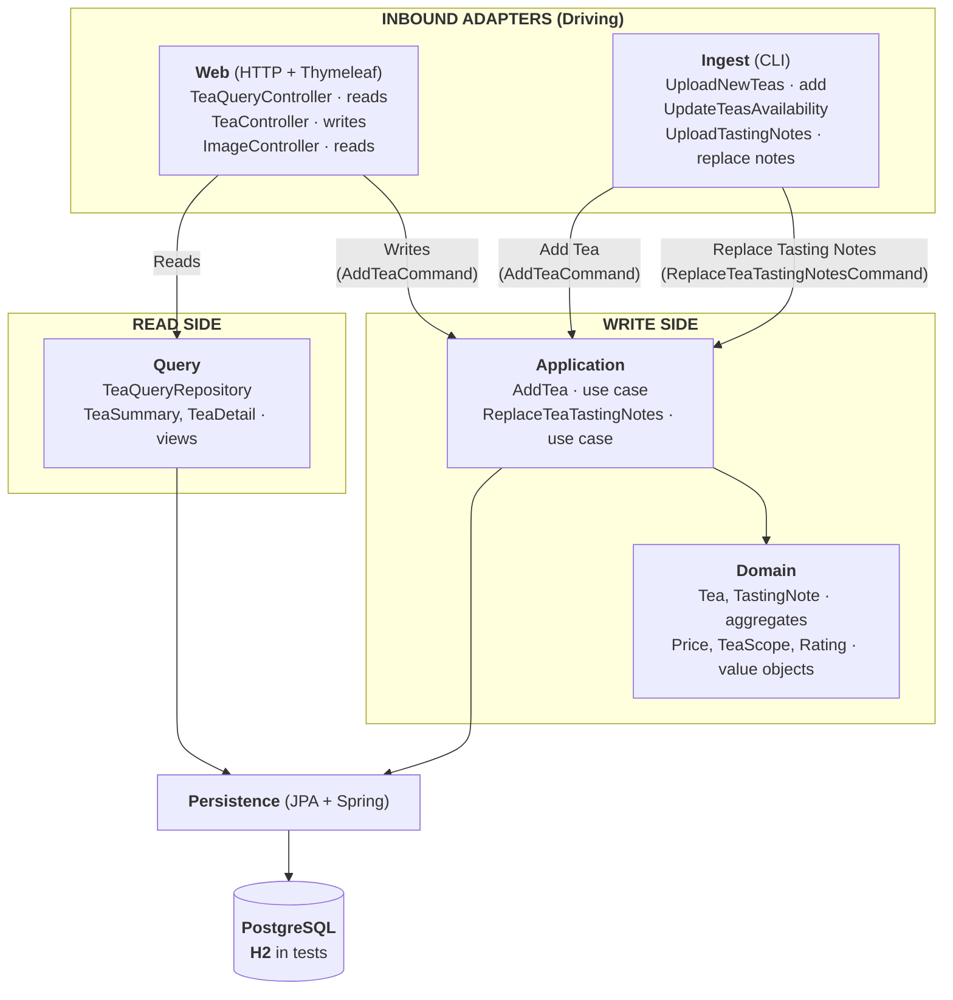

Sonar:  
[](https://sonarcloud.io/summary/new_code?id=dusan-rychnovsky_my-tea-collection)
[](https://sonarcloud.io/summary/new_code?id=dusan-rychnovsky_my-tea-collection)
[](https://sonarcloud.io/summary/new_code?id=dusan-rychnovsky_my-tea-collection)
[](https://sonarcloud.io/summary/new_code?id=dusan-rychnovsky_my-tea-collection)
[](https://sonarcloud.io/summary/new_code?id=dusan-rychnovsky_my-tea-collection)  
Better Stack:  
[](https://uptime.betterstack.com/?utm_source=status_badge)  
Hosting:  
[mytea.dusanrychnovsky.cz](https://mytea.dusanrychnovsky.cz)

# My Tea Collection

A web application designed to help you track your tea collection.

## Features

You can list your teas with detailed parameters and filter them using various criteria for efficient searching.

You can share links to your tea collection with friends, which makes it easy to keep them updated on which teas you have, or share details about a particular tea, etc.

## Technology

The application is built using Java, Spring, Thymleaf and PostgreSQL, and is Dockerized for efficient deployments.

### Architecture

The web application uses a layered, adapter-based design with a CQRS-style split between reads and writes and a small domain core, as illustrated in below diagram:



## How To

### Build the Application

```
mvn clean package
```

### Set Up the Database

1) **Create the database schema.**  
   Execute the following SQL statement:

```
CREATE SCHEMA myteacollection;
```

2) **Generate and apply DDL statements.**  
Use the commands below to generate a file named `ddl-schema.sql` containing `CREATE TABLE` statements for all entities. Execute all of them:

```
$env:SPRING_DATASOURCE_URL = "X"
$env:SPRING_DATASOURCE_USERNAME = "X"
$env:SPRING_DATASOURCE_PASSWORD = "X"
java `
  "-Dspring.jpa.properties.jakarta.persistence.schema-generation.create-source=metadata" `
  "-Dspring.jpa.properties.jakarta.persistence.schema-generation.scripts.action=create" `
  "-Dspring.jpa.properties.jakarta.persistence.schema-generation.scripts.create-target=ddl-schema.sql" `
  -jar .\target\myteacollection-0.0.1-SNAPSHOT.jar
```

3) **Insert bootstrapping data.**  
Execute statements from file `src\test\resources\data.sql`.

4) **(Optional) Create a user account.**  
Run `CreateUser` java class.

5) **(Optional) Populate the database with teas from my collection.**  
Run `UpladNewTeas` java class.

6) **(Optional) Populate the database with tasting notes.**  
Run `UploadTastingNotes` java class (reads each tea folder's `tasting-notes.json` and replaces that
tea's notes). Requires the `TastingNotes` table — regenerate and apply the DDL (step 2) after adding
the tasting-notes entity, and load the teas (step 5) first.

### Run the Application

```
docker build --tag=my-tea-collection:latest .
docker run -p8080:8080 `
  -e SPRING_DATASOURCE_URL=X `
  -e SPRING_DATASOURCE_USERNAME=X `
  -e SPRING_DATASOURCE_PASSWORD=X `
  my-tea-collection:latest
```

and then go to `http://localhost:8080/`
